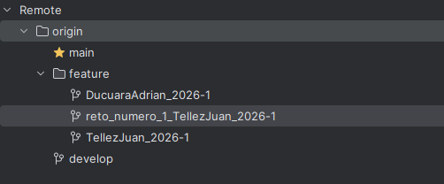
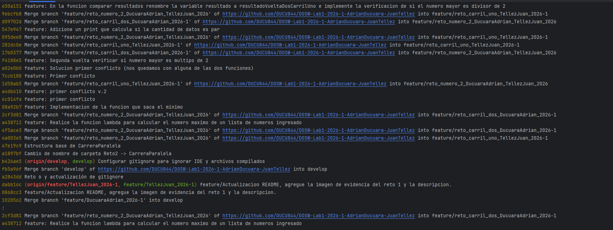
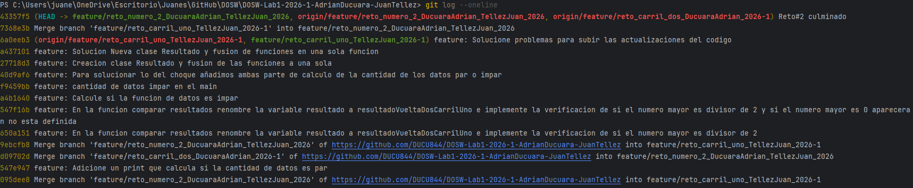
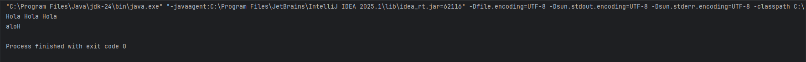
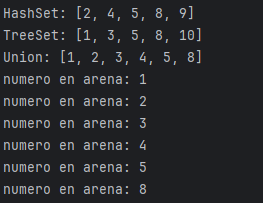
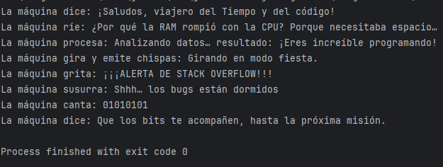
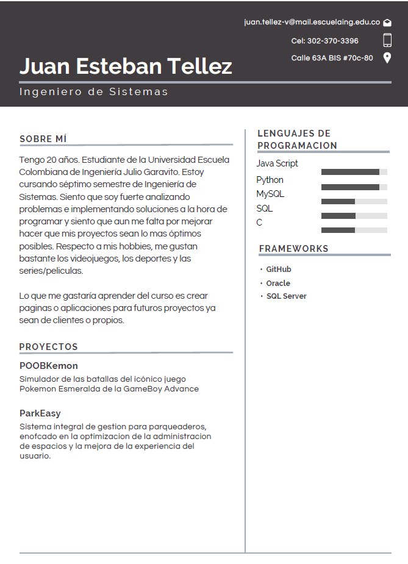
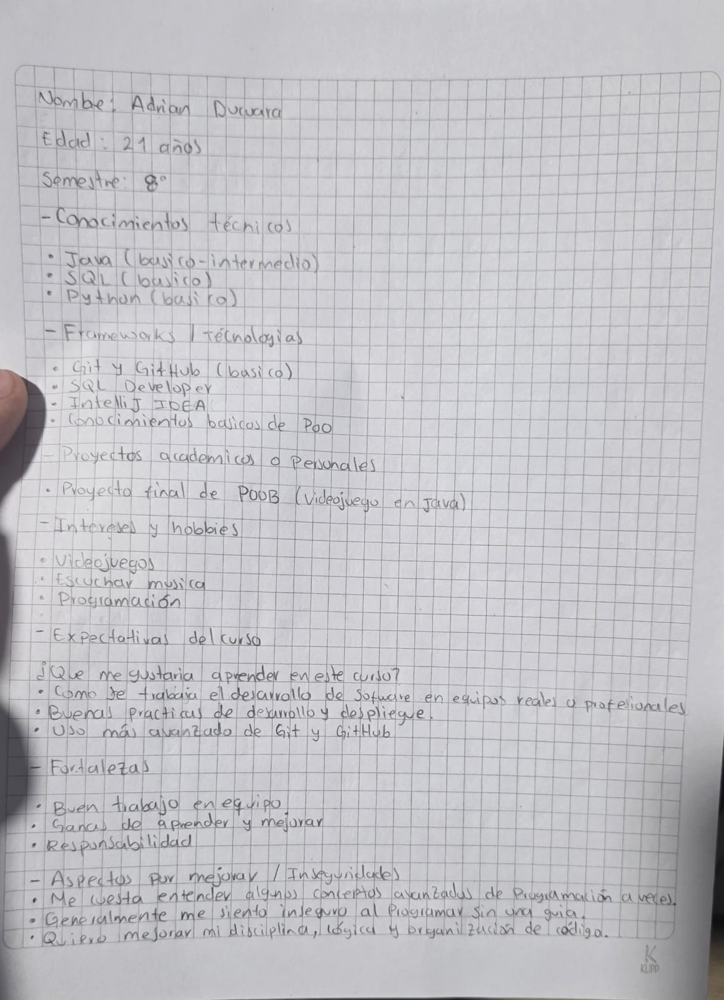

# Maraton Git  2026-1

## Integrantes
- Cristian Adrian Ducuara Quiñones
- Juan Esteban Tellez Valencia

---

## Retos completados

### Reto 1: Configuración y creación de rama 
**Evidencia:**

**Descripción:**
En este reto implementamos un sistema de bienvenida utilizando programación funcional en Java. El objetivo fue crear un mensaje personalizado que presenta a los integrantes del equipo usando expresiones lambda y streams.

---

### Reto 2: Commit Colaborativo
**Evidencia:**

**Descripción:**
En este reto nos enfretamos a una carrera en paralelo donde ambos teniamos que cordinarnos para poder avanzar en el reto subiendo nuestros cambios y actualizando la rama del reto 2 con merge

---

### Reto 3: Eco Misterioso
**Evidencia:**

**Descripción:**
En este reto se trabajó el manejo de cadenas de texto en Java utilizando StringBuilder y StringBuffer. La solución final consistió en unificar ambas implementaciones en una sola función que 
repite un mensaje tres veces utilizando Stream(), muestra el resultado intermedio en consola, invierte el mensaje resultante usando StringBuilder y
retorna el mensaje final invertido.

---

### Reto 5: Batalla de Conjuntos
**Evidencia:**

**Descripción:**
En este reto simulabamos una arena donde un equipo lucha sin orden(HashSet) y otro con orden natural(TreeSet), donde al final teniamos que unir los
dos equipos cumpliendo los siguientes requisitos:
Eliminar los multiplos de 3 en el HashSet
Eliminar los multiplos de 5 en el TreeSet

---

### Reto 6: La maquina de decisiones
**Evidencia:**

**Descripción:**
En este reto teniamos que implementar lo que le faltaba al manual de una maquina encontrada en el laboratorio secreto de la Escuela
en donde teniamos que imprementar metodos usando switch-case para que la maquina pueda revelar todo su poder.

---

## Preguntas teóricas

- Pregunta 1: ¿Cuál es la diferencia entre git merge y git rebase

  Respuesta: La diferencia es que Merge conserva la historia y rebase la ordena.

- Pregunta 2: Si dos ramas modifican la misma línea de un archivo, ¿qué sucede al hacer merge?

  Respuesta: Git genera un conflicto solicitando con cuales lineas de codigo te quedas.

- Pregunta 3: ¿Cómo puedes ver gráficamente el historial de merges y ramas en consola?

  Resouesta: Esto se puede desde la consola con el siguiente comando "git log --oneline --graph --all". Este comando mostrara visualmente
  las ramas , merges y commits.

- Pregunta 4: Explica la diferencia entre un commit y un push.

  Respuesta: La diferencia es que el commit guarda los cambios localmente donde se tiene que especificar cuales fueron los cambios
  y el push envia esos commits al repositorio remoto.

- Pregunta 5: ¿Para qué sirven git stash y git pop?

  Respuesta: El git stash guarda cambios sin hacer commits y el git stash pop recupera los cambios hechos en git stash.

- Pregunta 6: ¿Qué diferencia hay entre HashMap y HashTable?

  Respuesta: La diferencia es que el HashMap es rapido y permite null pero no es sincronizado mientras que el HashTable es lento, no permite el null y es sincronizado.

- Pregunta 7: ¿Qué ventajas tiene Collectors.toMap() frente a un bucle tradicional para llenar un mapa?

  Respuesta: El codigo sera mas limpio y declarativo, habra menos errores, hay una integracion directa con streams y evita bucles manuales.

- Pregunta 8: Si usas List con objetos y luego aplicas stream().map(), ¿qué tipo de operación estás haciendo?

  Respuesta: Es un operacion intermedia que convierte cada elemento en otro tipo o valor.

- Pregunta 9: ¿Qué hace el método stream().filter() y qué retorna?

  Respuesta: Lo que hace es que filtra elementos segun la condicion y retorna un stram con los elementos que cumplan la condicion.

- Pregunta 10: Describe el paso a paso de cómo crear una rama desde develop si es una funcionalidad nueva.

  Respuesta: Primero tenemos que irnos a la rama de develop con el comando "git checkout develop" y luego hacemos "git checkout -b feature/nombre_rama".

- Pregunta 11: ¿Cuál es la diferencia entre crear una rama con git branch y con git checkout -b?

  Respuesta: La diferencia es que git branch solo crea la rama mientras que con git checkout -b se va a crear la rama y ademas se cambia a la rama creada.

- Pregunta 12: ¿Por qué es recomendable crear ramas feature/ para nuevas funcionalidades en lugar de trabajar en main directamente?

  Respuesta: Es recomendable porque evita romper produccion, facilita las pruebas, permite el trabajo en paralelo y mantiene el main estable.

---

## Acuerdos mutuos de Trabajo

### Distribucion de responsabilidades
Cada uno estara dispuesto a realizar los trabajos asignados en cada parte del laboratorio donde generalmente el integrante Juan Tellez tomara los roles como Estudiante A y Adrian Ducuara tomara los roles del estudiante B.

### Forma de comunicacion
Nos comunicaremos mediante discord la mayor parte del tiempo.

### Frecuencia de trabajo
Tendremos una frecuencia de trabajo de al menos una hora por dia.

### Manejo de conflictos y desacuerdos
Cuando se presente un conflicto o desacuerdo se discutira la posicion actual de cada uno y sus justificiones para llegar a un acuerdo.

### Compromisos frente a entregas y calidad
Nos comprometemos a entregar la mayor parte del laboratorio manteniendo las buenas practicas.

---

## Hojas de vida

### Juan Tellez

### Adrian Ducuara

